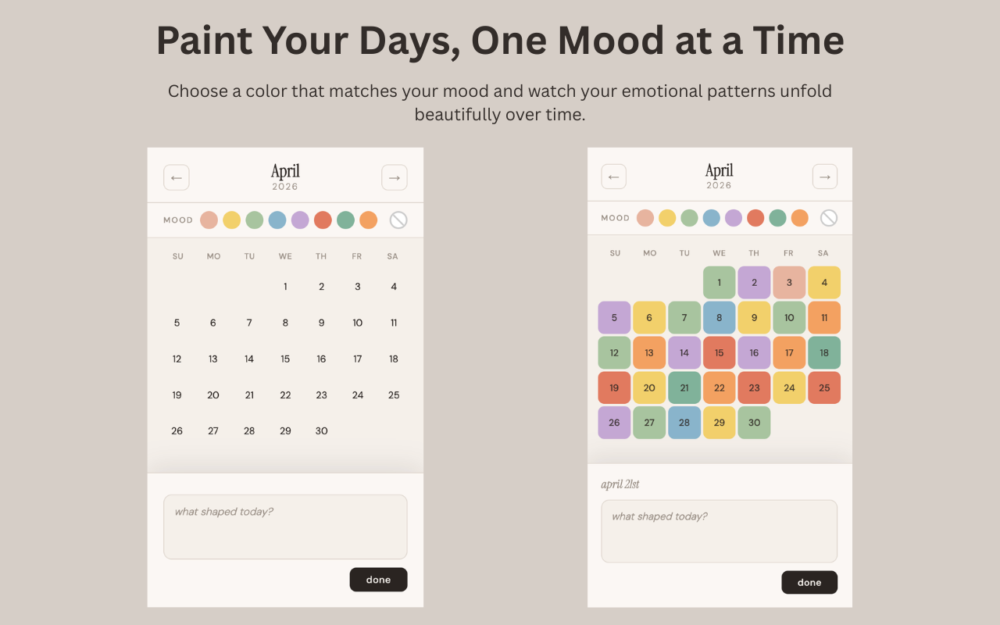

  

<h1 align="center">Palette - Mood Tracker</h1>

  A minimal Chrome extension for tracking your mood — one color at a time.

  

---

## What it does

Palette - Mood Tracker gives you a color-coded calendar that lives in your browser toolbar. Pick a color that matches how you're feeling, click the day, and optionally write a short note. Over time your month fills up with a quiet visual record of how things have been.

## Features

- 🎨 8 mood colors with labels (calm, happy, good, blue, mellow, stressed, grateful, energized)
- 📅 Monthly calendar view with previous month navigation
- 📝 Short notes per day — click any colored day to read or edit
- 🔴 Clear mode to erase a day's color
- 💾 All data stored locally — no account, no sync, no tracking

## Installation

1. Download or clone this repo
2. Go to `chrome://extensions` in Chrome
3. Enable **Developer mode** (toggle in the top right)
4. Click **Load unpacked** and select the `mood-extension` folder

## How to use

1. Select a mood color from the palette at the top
2. Click any day (today or in the past) to apply it
3. Click a colored day with no color selected to add or view a note
4. Use the ⊘ button to enter clear mode and erase a day's color

## Stack

Plain HTML, CSS, and JavaScript. No frameworks, no dependencies. Uses `chrome.storage.local` for persistence.

---

  Made with care, one day at a time.

